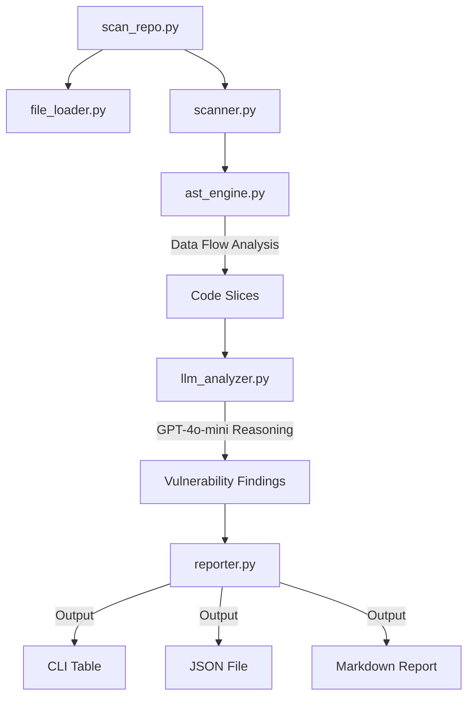

# 🛡️ RepoGuard: AI-Powered Security Scanner

A high-performance CLI tool and CI/CD guardian designed to identify both **traditional security vulnerabilities** and **modern AI/LLM-specific risks** in your codebases. 

[](https://github.com/ritesh-ui/RepoGuard/actions/workflows/repoguard.yml)
[](https://www.python.org/)
[](https://openai.com/)

---

## 🔥 Why RepoGuard?

Traditional static analysis security tools (SAST) often suffer from high false-positive rates and struggle with the dynamic nature of modern AI applications. **RepoGuard** stands out by combining the speed of pattern matching with the deep contextual reasoning of Large Language Models (LLMs).

### 🚀 How RepoGuard Stands Out:
- **Context-Aware Auditing**: Unlike simple regex-based tools, RepoGuard uses AI to understand *intent*. It doesn't just find a dangerous function; it reasons whether it's actually vulnerable in the context of your code.
- **AI-Native Security**: Specialized specifically for the modern AI stack. We detect **Prompt Injection**, **Vector DB Poisoning**, and **Unsafe Agent Tools**—vulnerabilities that traditional scanners completely miss.
- **Multi-Language AST Support**: Deep taint analysis for **Python** and **JavaScript/TypeScript** using industry-standard AST engines.
- **Zero-Config Intelligence**: No need for complex rule tuning. The LLM handles the complex security logic, providing instant, human-readable remediation advice for every finding.

---

## 🚀 Key Features

### 1. Unified Security Scan (AST-Powered)
- **Deep Taint Analysis**: Traces user input from entry points to dangerous "sinks" (DB, Shell, AI models).
- **Core Risks**: Hardcoded secrets, SQL Injection, Unsafe `eval()`.
- **AI Risks**: Prompt Injection, Vector Poisoning, Unsafe Agent Tools.

### 2. CI/CD Integration
- **Automated Workflows**: Seamlessly integrate with GitHub Actions.
- **Fail-on-Vulnerability**: Block merges if critical security risks are detected.
- **Professional Reporting**: Export findings to CLI, JSON, or professional Markdown (README format).

---

## 🏗 Architecture



---

## 🛠 Installation

1. **Clone the repo**:
   ```bash
   git clone https://github.com/ritesh-ui/RepoGuard.git
   cd RepoGuard
   ```

2. **Setup Virtual Environment**:
   ```bash
   python3 -m venv venv
   source venv/bin/activate
   ```

3. **Install Dependencies**:
   ```bash
   pip install -r requirements.txt
   pip install tree-sitter tree-sitter-languages
   ```

4. **Configure OpenAI API**:
   Create a `.env` file in the root directory:
   ```env
   OPENAI_API_KEY=your_key_here
   OPENAI_MODEL=gpt-4o-mini
   ```

---

## 🤖 GitHub Actions Integration

RepoGuard is built to work seamlessly in your CI/CD pipeline. 

### 1. Setup Secrets
- Go to your repository **Settings** > **Secrets and variables** > **Actions**.
- Add a new secret named `OPENAI_API_KEY` with your OpenAI key.

### 2. Add Workflow
Create `.github/workflows/repoguard.yml` in your repository. This will automatically scan your project on every push:

```yaml
name: RepoGuard Security Scan

on: [push, pull_request]

jobs:
  scan:
    runs-on: ubuntu-latest
    steps:
      - uses: actions/checkout@v4
      - uses: actions/setup-python@v5
        with: { python-version: '3.9' }
      - run: pip install -r requirements.txt && pip install tree-sitter tree-sitter-languages
      - env:
          OPENAI_API_KEY: ${{ secrets.OPENAI_API_KEY }}
        run: python scan_repo.py . --markdown SECURITY_REPORT.md --fail-on Critical
```

---

## 📖 Usage

### Scan a Local Directory
```bash
python3 scan_repo.py /path/to/your/repo
```

### Fail Build on High/Critical Risks
```bash
python3 scan_repo.py /path/to/repo --fail-on High
```

### Scan a Remote Git URL
```bash
python3 scan_repo.py https://github.com/user/repo --branch main
```

---

## 🛡️ License
Distribute under the MIT License. See `LICENSE` for more information.
