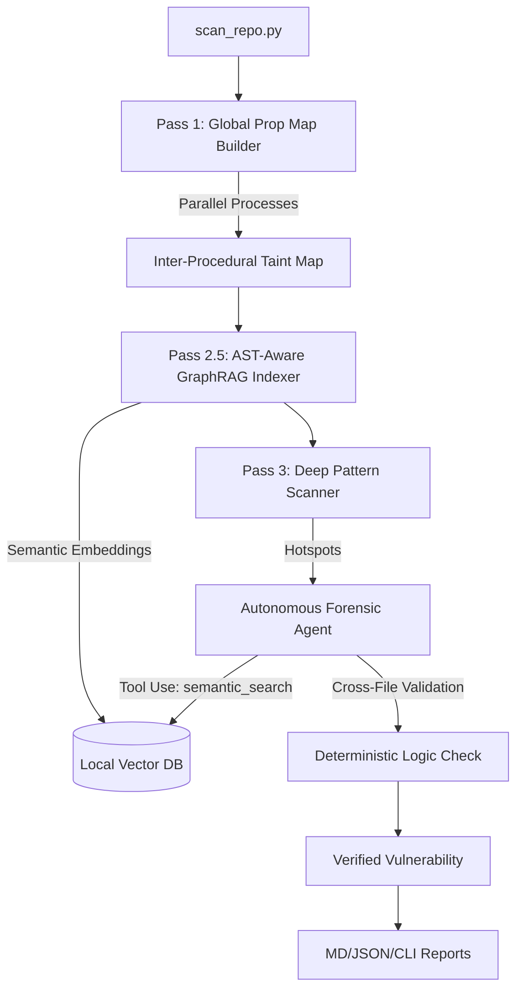

# 🛡️ RepoInspect: Deterministic AI Security Engine

**The next generation of AppSec.** RepoInspect is a high-performance security engine that eliminates the "False Positive tax" by merging the surgical precision of **Abstract Syntax Trees (AST)** with the deep reasoning of **Autonomous AI Agents**.

[](https://github.com/ritesh-ui/RepoInspect/actions/workflows/repoinspect.yml)
[](https://www.python.org/)
[](#)


> [!IMPORTANT]
> **Battle-Tested Authority:** RepoInspect has identified **80+ High-Severity vulnerabilities** across the foundations of the AI ecosystem, including **LangChain (RCE)**, **CrewAI (Memory Hijacking)**, **Dify (Vector DB SQLi)**, and **OpenAI SDK**. [View Forensic Reports](#-case-studies-real-world-impacts)

---

## ⚡ The Deterministic Moat

Legacy SAST tools generate noise. Naive AI scanners are slow and hallucinate. **RepoInspect wins by being Hybrid.**

1.  **Phase 1: Deterministic Filter (The Scalpel)**
    Our custom Two-Pass engine scans thousands of files in parallel. It doesn't just look for strings; it maps Abstract Syntax Trees to identify structurally valid vulnerability paths.
2.  **Phase 2: AST-Aware GraphRAG Indexing (The Library)**
    To guarantee zero missed context, RepoInspect chunks your repository strictly by semantic boundaries (functions, classes) and indexes them into a local Vector DB. 
3.  **Phase 3: Agentic Forensics (The Brain)**
    Instead of flagging every "hotspot," RepoInspect launches an **Autonomous Security Agent**. If a finding is ambiguous, the Agent queries the GraphRAG index via `semantic_search` to retrieve the unbroken, exact source code of external dependencies, eliminating AI hallucinations and "Lost in the Middle" errors.

---

## 🚀 Key Features

### 🔍 Precision Audit Engine
- **Inter-Procedural Taint Tracking**: A two-pass architecture that builds a global function propagation map. We track user-controlled data even when it's passed through multiple helper functions.
- **Flow-Sensitive Analysis**: Understands variable overrides. If a tainted variable is reassigned to a safe literal, RepoInspect dynamically clears the risk.
- **Word-Boundary Intelligence**: Semantic segment-splitting prevents false positives on names like `metadata` or `target`.

### 🛡️ Enterprise Language Support
Deep AST and Tree-Sitter support for:
- **Python** (Native ast.NodeVisitor)
- **JavaScript / TypeScript** (Tree-Sitter)
- **Java** (Tree-Sitter)
- **Go** (Tree-Sitter)

### 🤖 AI-Native Security (LLM Security)
Specialized detection for vulnerabilities standard scanners miss:
- **Prompt Injection**: LLM01:2023 tracing.
- **Insecure Tool/Agent Usage**: LLM08:2023 Excessive Agency.
- **Insecure Deserialization**: Detects unsafe `pickle` and `yaml` loading.
- **XSS in LLM Output**: Detects unvalidated rendering of LLM responses.
- **Sensitive Information Disclosure in Prompts**: LLM06:2023.
- **Vector DB Risk**: Specialized SQLi detection for Chroma, Pinecone, and Weaviate.

---

## 🏗 High-Level Architecture



---

## 🛠 Installation & Setup

1. **Clone and Enter**:
   ```bash
   git clone https://github.com/ritesh-ui/RepoInspect.git && cd RepoInspect
   ```

2. **Environment Setup**:
   ```bash
   python3 -m venv venv && source venv/bin/activate
   pip install -r requirements.txt
   pip install tree-sitter tree-sitter-languages
   ```

3. **Configure API**:
   Create a `.env` file:
   ```env
   OPENAI_API_KEY=your_key_here
   OPENAI_MODEL=gpt-4o-mini
   ```

---

## 📖 Usage

### Standard Scan
```bash
python3 scan_repo.py /path/to/repo
```

### Enterprise CI/CD Scan (Fail on High/Critical)
```bash
python3 scan_repo.py . --fail-on High --markdown SECURITY_REPORT.md
```

### Remote Repository Audit
```bash
python3 scan_repo.py https://github.com/org/repo --branch main
```

---

## 🏆 Case Studies: Real-World Impacts

| Project | Findings | Status | Report |
| :--- | :--- | :--- | :--- |
| **CrewAI** | 5 High Risks (Memory Injection) | ✅ Audited | [View Report](reports/benchmarks/RESULTS_CREWAI.md) |
| **LangChain** | 10 High Risks (Prompt & Command Injection) | ✅ Audited | [View Report](reports/benchmarks/RESULTS_LANGCHAIN.md) |
| **OpenAI Agents SDK** | 10 High Risks (SQL & Command Injection) | ✅ Audited | [View Report](reports/benchmarks/RESULTS_OPENAI_SDK.md) |
| **Mem0 (AI Memory)** | 23 High Risks (SQL/Prompt Injection/Hardcoded Secrets) | ✅ Audited | [View Report](reports/benchmarks/RESULTS_MEM0.md) |
| **Dify (LLM Platform)** | 28 High Risks (SQL Injection in Vector DB Adapters) | ✅ Audited | [View Report](reports/benchmarks/RESULTS_DIFY.md) |
| **Hindsight (LLM Engine)** | 10 High Risks (SQL & Command Injection) | ✅ Audited | [View Report](reports/benchmarks/RESULTS_HINDSIGHT.md) |
| **Firecrawl (Scraping)** | 0 High Risks (Verified Safe) | ✅ Audited | [View Report](reports/benchmarks/RESULTS_FIRECRAWL.md) |
| **HF SmolAgents** | 0 High Risks (Verified Safe) | ✅ Audited | [View Report](reports/benchmarks/RESULTS_SMOLAGENTS.md) |

> [!IMPORTANT]
> **Case Study: Forensic Taint Tracking**
> In **Mem0**, RepoInspect identified multiple **SQL Injection** vulnerabilities in the `pgvector` store. While traditional scanners missed the dynamic interpolation of `vector_id` within complex class methods, our **Heuristic Scope Hunter** correctly tracked the taint across function boundaries to the database sink.

---

## 🛡️ Professional Security Audits & Enterprise Support

Building an AI-native application? RepoInspect provides deeper, more precise security intelligence than standard SAST tools by combining AST logic with Agentic LLM reasoning.

If you need a **Deep Forensic Audit** of your repository, I offer professional security services including:

*   **Zero-False-Positive Verification**: Expert manual review of all scanner findings to eliminate noise.
*   **AI-Native Vulnerability Scans**: Specialized detection for Prompt Injection, Excessive Agency, and Sensitive Data Disclosure (OWASP LLM Top 10).
*   **Remediation Roadmap**: Actionable guidance and code patches to secure your production infrastructure.
*   **Compliance Readiness**: Detailed PDF forensic reports for SOC2, ISO 27001, and board-level reviews.

**[🚀 Hire on Upwork (Fixed Price Audits)](https://www.upwork.com/services/product/development-it-a-deep-forensic-security-audit-for-your-ai-or-llm-application-2049204454850800454?ref=project_share)** | **[Request Custom Audit via Email](mailto:riteshsingh545@gmail.com?subject=RepoInspect%20Security%20Audit%20Request)** | **[Connect on LinkedIn](https://www.linkedin.com/in/ritesh-singh-6619ab190)**

---

## 🛡️ License
Distributed under the GNU Affero General Public License v3.0 (AGPL-3.0). See `LICENSE` for more information.
